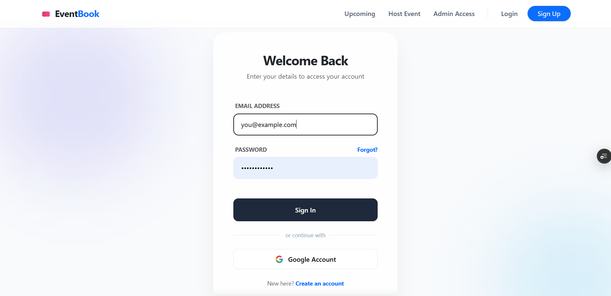
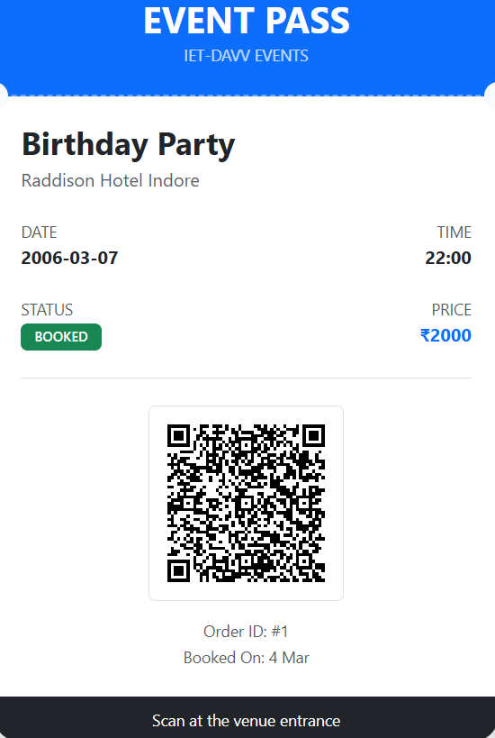

# 🎟️ EventBook

[](https://nodejs.org/)
[](https://reactjs.org/)
[](https://www.postgresql.org/)
[](https://sequelize.org/)
[](https://stripe.com/)

**EventBook** is a robust event management ecosystem built on the PERN stack. It leverages the relational power of **PostgreSQL** and **Sequelize ORM** to manage complex ticket inventories, secure **Stripe** transactions, and real-time **QR-code** entry validation.

[**Live Demo »**](https://your-app-link.com) | [**Report Bug »**](https://github.com/your-username/repo/issues) | [**Request Feature »**](https://github.com/your-username/repo/issues)

---

## ✨ Key Features

* **💳 Secure Payments:** Seamless **Stripe Checkout** integration for global ticket sales.
* **📱 QR Entry System:** Dynamic QR codes generated for every ticket, verified via backend scanning.
* **🗄️ Relational Data:** Structured PostgreSQL schema to manage Users, Events, and Bookings with full integrity.
* **🔒 JWT Authentication:** Secure user sessions and protected API routes.
* **🔄 Deployment Optimized:** Configured for SPA routing to prevent 404 errors on refresh.

---

## 🛠️ Tech Stack

| Layer | Technology | Role |
| :--- | :--- | :--- |
| **Frontend** | React.js | Dynamic UI and booking interface. |
| **Backend** | Node.js / Express | RESTful API and Stripe Webhook handling. |
| **Database** | PostgreSQL | Relational storage for reliable data persistence. |
| **ORM** | Sequelize | Promise-based Node.js ORM for Postgres. |
| **Payments** | Stripe API | Managed payment sessions and security. |
| **QR Logic** | QRCode.react | Client-side ticket encoding. |

---

## 🔄 The Ticket Lifecycle

1. **Selection:** User chooses an event and quantity.
2. **Payment:** **Stripe** processes the transaction.
3. **Webhook:** The backend receives a `checkout.session.completed` event.
4. **Database:** **Sequelize** creates a new `Booking` record with a unique UUID.
5. **Validation:** Staff scan the QR (containing the UUID). The server checks the DB and updates the `is_redeemed` flag.

---

## 🖼️ App Preview

| 🔐 OAuth Authentication | 💳 Event Details | 🎟️ Digital Ticket |
| :---: | :---: | :---: |
|  |  |  |

---

## 🚀 Installation & Setup

### 1. Clone & Install
```bash
git clone [https://github.com/your-username/eventpulse-pro.git](https://github.com/your-username/eventpulse-pro.git)
cd eventpulse-pro
npm install
